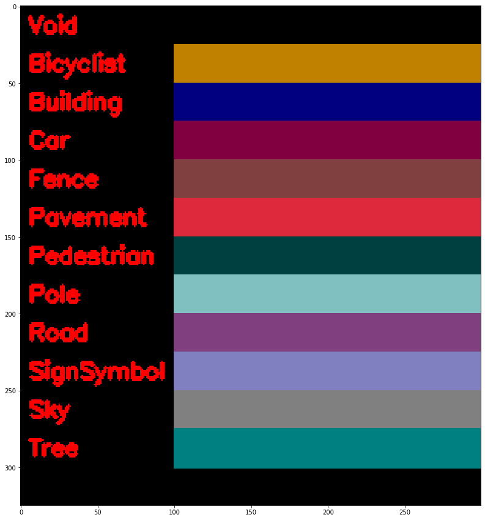

# Pytorch Implementation of [ENet: A Deep Neural Network Architecture for Real-Time Semantic Segmentation](https://arxiv.org/abs/1606.02147) #

## TODO

- [x] Implement Enet network
- [x] Train Enet on [Camvid](http://mi.eng.cam.ac.uk/research/projects/VideoRec/CamVid/) Dataset
- [ ] Train Enet on [Cityscapes](https://www.cityscapes-dataset.com/) Dataset
- [ ] Test with [Lovasz Softmax Loss](https://github.com/bermanmaxim/LovaszSoftmax)

## [Camvid Dataset](http://mi.eng.cam.ac.uk/research/projects/VideoRec/CamVid/) ##
***
- This dataset consists of street images whose pixels are labeled into 11+1 classes (one "Void" class for the ego-car)
- Run
```bash
bash ./scripts/download_camvid.sh
```
to fetch and unzip the dataset into data directory

### Colors for Each Label Class ###
***



### How To ###
***

- Train on Camvid:
```bash
python3 camvid_train.py
```

- Test on test set of Camvid
```bash
python3 ./scripts/test_camvid_testset.py
```

You should see the following result:


## References
- [Original Implementation](https://github.com/e-lab/ENet-training/tree/master/train)
- [Reference pytorch implementation of Enet](https://github.com/soumik12345/Enet)
