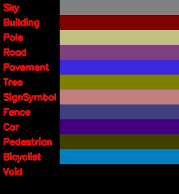

## [Camvid Dataset](http://mi.eng.cam.ac.uk/research/projects/VideoRec/CamVid/) ##
***
- This dataset consists of street images whose pixels are labeled into 11+1 classes (one "Void" class for the ego-car)
- Run
```bash
bash ./scripts/download_camvid.sh
```
to fetch and unzip the dataset into data directory

### Colors for Each Label Class ###
***


